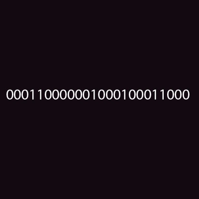
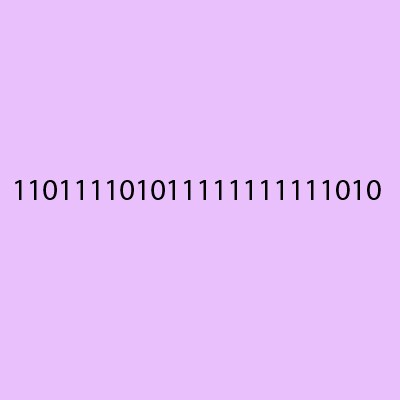
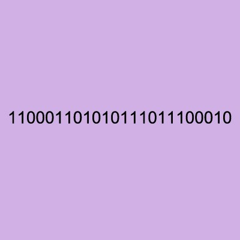

# NoOpen
First year C project on encryption

To understand why, we need to first introduce the AND, OR and XOR bitwise operations. Specifically, why XOR must be used when performing the one-time pad on computers. Bitwise simply means that we are dealing with individual bits, or binary numbers. In any modern/computerized encryption scheme we represent our symbols using binary digits.
AND
The AND operator is also known as logical conjunction, and works just like multiplication. 
It outputs a 1 only if all of the inputs are 1. Here is the truth table:
0 AND 0 = 0
0 AND 1 = 0
1 AND 0 = 0
1 AND 1 = 1
Let’s try it:
100111001011010100111010 AND 010110100001101111011000 = 000110000001000100011000

 
This results in a very dark purple. Notice when we perform the AND operation on any binary number, the resulting sequence cannot be larger. In our color example this eliminates many possible shades as it pushes the color towards black.
OR
The OR operator is also known as logical disjunction. It outputs a 1 whenever one or more of its inputs are 1. Here is the truth table:
0 OR 0 = 0
0 OR 1 = 1
1 OR 0 = 1
1 OR 1 = 1
Let’s try it:
100111001011010100111010 OR 010110100001101111011000 = 110111101011111111111010

 
This results in a light purple. Notice when we perform the OR operation on any binary sequence, the resulting sequence cannot be smaller. This eliminates many possibilities as it pushes the color towards white.
XOR
The XOR operator outputs a 1 whenever the inputs do not match, which occurs when one of the two inputs is exclusively true. This is the same as addition mod 2. Here is the truth table:
0 XOR 0 = 0
0 XOR 1 = 1
1 XOR 0 = 1
1 XOR 1 = 0
Let's try it:
100111001011010100111010 XOR 010110100001101111011000 = 110001101010111011100010

 
This results in a slightly darker purple as compared to the OR operation. Notice when we perform the XOR operation on a binary sequence, the resulting sequence could be any possible sequence. Given some encrypted color, all we know is the original color is “equally likely to be any color”. We have no information that could improve a blind guess (1/16 million).
Why must we use XOR?
Does it really matter if we used AND, OR or XOR with the one-time pad? The answer is yes, and it’s extremely important to understand why. Recall from the previous article that AND has a 75% chance of outputting 0 and a 25% chance of outputting a 1. While OR has a 25% chance of outputting 0 and 75%chance of outputting 1. While the XOR operation has a 50% chance of outputting 0 or 1.
